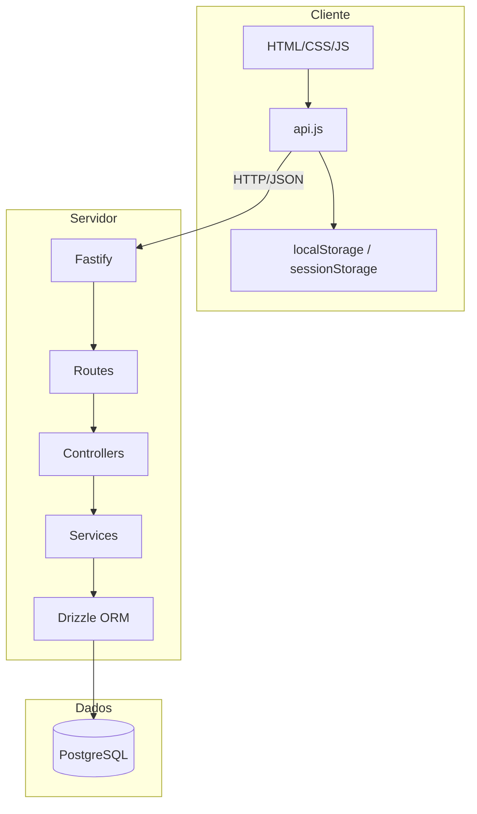
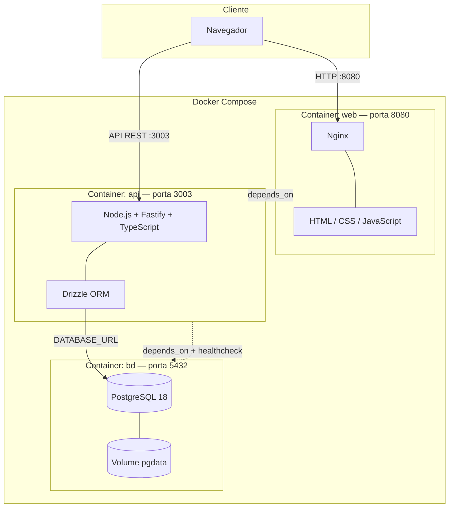
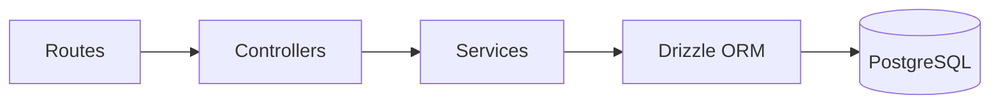
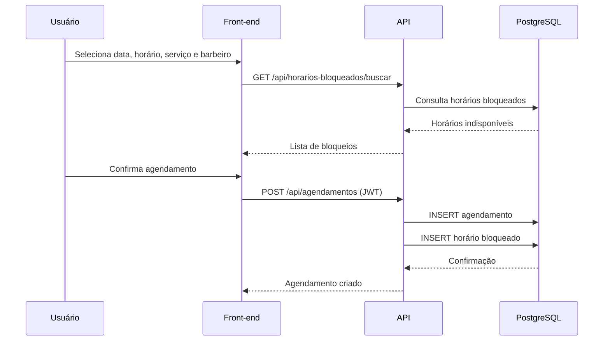
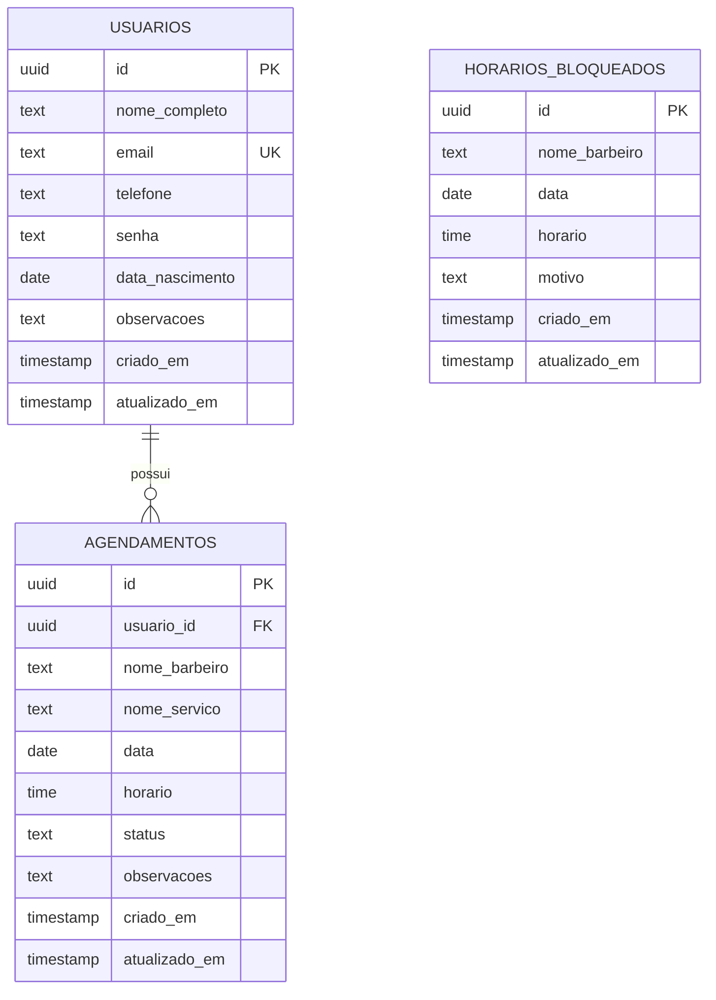
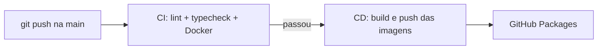

# Barbearia Style — Sistema de Agendamento Online (APRESENTADO)

Sistema web full-stack para gerenciamento de agendamentos de uma barbearia, desenvolvido como trabalho acadêmico da disciplina **Programação Web II** (UFPI). O projeto permite que clientes visualizem serviços e barbeiros, realizem agendamentos online, gerenciem o perfil e acompanhem o histórico de reservas.

---

## Índice

- [Visão Geral](#visão-geral)
- [Funcionalidades](#funcionalidades)
- [Arquitetura](#arquitetura)
  - [Containers Docker](#containers-docker-docker-compose)
- [Tecnologias](#tecnologias)
- [Estrutura do Projeto](#estrutura-do-projeto)
- [Instalação e Execução](#instalação-e-execução)
- [CI/CD](#cicd)
- [API REST](#api-rest)
- [Banco de Dados](#banco-de-dados)
- [Fases do Trabalho Acadêmico](#fases-do-trabalho-acadêmico)
- [Notas Técnicas](#notas-técnicas)
- [Licença e Autores](#licença-e-autores)

---

## Visão Geral

A aplicação é dividida em dois módulos principais:

| Módulo | Descrição | Porta |
|--------|-----------|-------|
| **Front-end** (`web/`) | Interface estática servida pelo Nginx | `8080` |
| **Back-end** (`server/`) | API REST com Fastify e PostgreSQL | `3003` |

O front-end consome a API via `Fetch`, armazena o token JWT no `localStorage` e protege páginas restritas com `auth-guard.js`. Serviços e barbeiros são exibidos estaticamente no HTML da home; os agendamentos, autenticação e horários bloqueados são persistidos no banco de dados.

---

## Funcionalidades

### Autenticação

- Cadastro de usuários com validação (Zod) e senha hasheada com **bcrypt**
- Login com geração de JWT (validade de 7 dias)
- Verificação de token em rotas protegidas
- Rate limit no login: **5 tentativas por minuto** por IP
- Guard de rotas no front-end (`auth-guard.js`)

### Perfil do Usuário

- Visualização e edição de dados pessoais
- Histórico de agendamentos
- Exclusão de conta

### Agendamentos

- Calendário interativo para seleção de data e horário
- Consulta de horários bloqueados por barbeiro e data
- Criação de agendamento (requer login)
- Cancelamento com desbloqueio automático do horário
- Status: `pendente`, `confirmado`, `concluido`, `cancelado`, `futuro`

### Interface

- Design responsivo (desktop, tablet e mobile)
- Tema claro/escuro com persistência no `localStorage`
- Calculadora de preços com desconto em pacotes
- Cookies de visita (contador e última visita)
- Rascunho de agendamento em `sessionStorage`
- Saudação dinâmica por horário do dia
- Botão de contato via WhatsApp
- Carrossel, modais e animações de scroll

---

## Arquitetura

### Visão geral



### Containers Docker (Docker Compose)

Ao executar `docker compose up`, a aplicação sobe em **três containers** independentes, orquestrados pelo Docker Compose:



| Container | Imagem / Build | Porta exposta | Função |
|-----------|----------------|---------------|--------|
| **bd** | `postgres:18` | `5432` | Banco de dados relacional com volume persistente (`pgdata`) |
| **api** | `Dockerfile.api` | `3003` | API REST; executa migrações na inicialização e conecta ao host `bd` |
| **web** | `Dockerfile.web` | `8080` → `80` | Front-end estático servido pelo Nginx |

O navegador acessa o front-end pela porta **8080** e a API diretamente pela porta **3003** (conforme `API_BASE_URL` em `web/script/api.js`). Dentro da rede Docker, a API se conecta ao banco pelo hostname **`bd`**.

### Camadas do back-end



| Camada | Responsabilidade |
|--------|------------------|
| **Routes** | Definição dos endpoints e prefixos |
| **Controllers** | Validação de entrada (Zod) e respostas HTTP |
| **Services** | Regras de negócio |
| **Database** | Schemas, migrações e queries via Drizzle |

### Fluxo de agendamento



### Modelo de dados



> **Nota:** `horarios_bloqueados` não possui FK direta para `agendamentos`. O vínculo é lógico — ao criar um agendamento, um bloqueio é inserido; ao cancelar, o bloqueio correspondente é removido.

---

## Tecnologias

### Front-end

| Tecnologia | Uso |
|------------|-----|
| HTML5, CSS3, JavaScript (ES6+) | Estrutura, estilo e interatividade |
| Fetch API | Comunicação com o back-end |
| Font Awesome 6 | Ícones |
| localStorage | Token JWT e preferências do usuário |
| sessionStorage | Rascunho de agendamento (`bookingDraft`) |
| Cookies | Consentimento, contador de visitas e última visita |

### Back-end

| Tecnologia | Versão | Uso |
|------------|--------|-----|
| Node.js | 18+ | Runtime |
| TypeScript | 5.9 | Linguagem |
| Fastify | 5.6 | Framework HTTP |
| Drizzle ORM | 0.44 | Acesso ao PostgreSQL |
| PostgreSQL | 18 | Banco de dados |
| Zod | 4.1 | Validação de schemas |
| bcrypt | 6.0 | Hash de senhas |
| @fastify/jwt | 10.0 | Autenticação JWT |
| @fastify/rate-limit | 10.3 | Limite de requisições |
| @fastify/cors | 11.1 | CORS |

### Ferramentas

| Ferramenta | Uso |
|------------|-----|
| Drizzle Kit | Migrações e Drizzle Studio |
| TSX | Execução de TypeScript |
| Biome | Linter e formatador |
| Docker / Docker Compose | Orquestração dos containers (banco, API e front-end) |
| Nginx | Servidor estático do front-end |

---

## Estrutura do Projeto

```
Trabalho-PWEB-II/
│
├── web/                          # Front-end
│   ├── index/
│   │   ├── home.html             # Página principal
│   │   ├── login.html            # Login e cadastro
│   │   └── profile.html          # Perfil do usuário
│   ├── script/
│   │   ├── api.js                # Cliente HTTP da API
│   │   ├── auth-guard.js         # Proteção de rotas
│   │   ├── home.js               # Lógica da home
│   │   ├── login.js              # Lógica de autenticação
│   │   ├── profile.js            # Lógica do perfil
│   │   └── theme.js              # Tema claro/escuro
│   ├── style/
│   │   ├── common.css
│   │   ├── home.css
│   │   ├── login.css
│   │   └── profile.css
│   └── img/                      # Imagens e favicon
│
├── server/                       # Back-end
│   ├── src/
│   │   ├── controllers/          # Validação e orquestração HTTP
│   │   ├── services/             # Regras de negócio
│   │   ├── routes/               # Definição de rotas
│   │   ├── db/
│   │   │   ├── schema/           # Schemas Drizzle
│   │   │   ├── migrations/       # Migrações SQL
│   │   │   ├── index.ts          # Conexão com o banco
│   │   │   └── seed.ts           # Seed (vazio por padrão)
│   │   ├── env/                  # Validação de variáveis de ambiente
│   │   └── server.ts             # Entrada da aplicação
│   ├── drizzle.config.ts
│   ├── package.json
│   └── .env.example
│
├── .github/workflows/ci-cd.yml   # Pipeline CI/CD (GitHub Actions)
├── docker-compose.yml            # Orquestração completa
├── Dockerfile.api                # Imagem da API
├── Dockerfile.web                # Imagem do front-end (Nginx)
├── nginx.conf                    # Configuração do Nginx
└── README.md
```

---

## Instalação e Execução

### Pré-requisitos

- [Docker](https://www.docker.com/) e Docker Compose instalados
- Git (opcional)

### Executar com Docker Compose

Sobe banco de dados, API e front-end de uma vez:

```bash
git clone <url-do-repositorio>
cd Trabalho-PWEB-II
docker compose up --build
```

| Serviço | URL |
|---------|-----|
| Front-end | http://localhost:8080 |
| API | http://localhost:3003 |
| Health check | http://localhost:3003/ping |

O container da API executa as migrações automaticamente na inicialização.

Para encerrar:

```bash
docker compose down
```

### Verificação rápida

1. `GET http://localhost:3003/ping` → `{"message":"pong"}`
2. Front-end disponível em http://localhost:8080
3. `docker ps` mostra os containers `bd`, `api` e `web` ativos

---

## CI/CD

O projeto usa **GitHub Actions** para integração e entrega contínua. O workflow está em `.github/workflows/ci-cd.yml`.

### CI (Integração Contínua)

Roda em **todo push** e em **pull requests** para a branch `main`:

| Etapa | O que valida |
|-------|----------------|
| Lint | Código do back-end com Biome |
| Typecheck | Compilação TypeScript sem erros |
| Smoke test | `docker compose build`, sobe os 3 containers, testa `/ping` e o front-end |

### CD (Entrega Contínua)

Roda **somente após o CI passar** em push na branch `main`:

1. Constrói as imagens Docker da API e do front-end
2. Publica no **GitHub Container Registry** (`ghcr.io`)
3. Gera um resumo do deploy na aba Actions

Imagens publicadas:

- `ghcr.io/<usuario>/<repositorio>/barbearia-api:latest`
- `ghcr.io/<usuario>/<repositorio>/barbearia-web:latest`

### Como provar na apresentação

1. Faça um `git push` na branch `main`
2. No GitHub, abra a aba **Actions** do repositório
3. Mostre o workflow **CI/CD** com os jobs:
   - **CI — Validar código e containers** (verde)
   - **CD — Publicar imagens Docker** (verde, só na `main`)
4. Clique no job de CD e mostre o **Summary** com as imagens publicadas
5. Na página do repositório, abra **Packages** e mostre as imagens `barbearia-api` e `barbearia-web`



---

## API REST

Base URL: `http://localhost:3003`

### Autenticação (`/auth`)

| Método | Endpoint | Auth | Descrição |
|--------|----------|------|-----------|
| `POST` | `/auth/cadastro` | Não | Cadastra novo usuário |
| `POST` | `/auth/login` | Não | Login (rate limit: 5/min) |
| `GET` | `/auth/verificar-token` | Sim | Valida o JWT |

### Usuários (`/api/usuarios`)

| Método | Endpoint | Auth | Descrição |
|--------|----------|------|-----------|
| `GET` | `/api/usuarios/perfil` | Sim | Retorna perfil do usuário logado |
| `PUT` | `/api/usuarios/perfil` | Sim | Atualiza perfil |
| `DELETE` | `/api/usuarios/perfil` | Sim | Exclui conta |

### Agendamentos (`/api/agendamentos`)

| Método | Endpoint | Auth | Descrição |
|--------|----------|------|-----------|
| `GET` | `/api/agendamentos` | Sim | Lista todos os agendamentos |
| `GET` | `/api/agendamentos/meus-agendamentos` | Sim | Lista agendamentos do usuário logado |
| `GET` | `/api/agendamentos/:id` | Sim | Busca agendamento por ID |
| `POST` | `/api/agendamentos` | Sim | Cria agendamento |
| `PUT` | `/api/agendamentos/:id` | Sim | Atualiza agendamento |
| `PATCH` | `/api/agendamentos/:id/cancelar` | Sim | Cancela agendamento |
| `DELETE` | `/api/agendamentos/:id` | Sim | Remove agendamento |

### Horários bloqueados (`/api/horarios-bloqueados`)

| Método | Endpoint | Auth | Descrição |
|--------|----------|------|-----------|
| `GET` | `/api/horarios-bloqueados` | Não | Lista todos |
| `GET` | `/api/horarios-bloqueados/data/:data` | Não | Lista por data (`YYYY-MM-DD`) |
| `GET` | `/api/horarios-bloqueados/buscar?nomeBarbeiro=X&data=Y` | Não | Lista por barbeiro e data |
| `GET` | `/api/horarios-bloqueados/:id` | Não | Busca por ID |
| `POST` | `/api/horarios-bloqueados` | Não | Cria bloqueio manual |
| `DELETE` | `/api/horarios-bloqueados/:id` | Não | Remove bloqueio |

### Exemplos

**Login**

```http
POST /auth/login
Content-Type: application/json

{
  "email": "usuario@example.com",
  "senha": "senha123"
}
```

**Criar agendamento**

```http
POST /api/agendamentos
Authorization: Bearer <token>
Content-Type: application/json

{
  "nomeBarbeiro": "Luciano Sousa Barbosa",
  "nomeServico": "Corte Masculino",
  "data": "2026-06-15",
  "horario": "14:30",
  "observacoes": "Corte na máquina 2"
}
```

---

## Banco de Dados

### Tabela `usuarios`

| Campo | Tipo | Descrição |
|-------|------|-----------|
| `id` | UUID | Chave primária |
| `nome_completo` | TEXT | Nome completo |
| `email` | TEXT | E-mail único |
| `telefone` | TEXT | Telefone |
| `senha` | TEXT | Hash bcrypt |
| `data_nascimento` | DATE | Data de nascimento |
| `observacoes` | TEXT | Observações (opcional) |
| `criado_em` | TIMESTAMP | Data de criação |
| `atualizado_em` | TIMESTAMP | Última atualização |

### Tabela `agendamentos`

| Campo | Tipo | Descrição |
|-------|------|-----------|
| `id` | UUID | Chave primária |
| `usuario_id` | UUID | FK → `usuarios.id` |
| `nome_barbeiro` | TEXT | Nome do barbeiro |
| `nome_servico` | TEXT | Nome do serviço |
| `data` | DATE | Data do agendamento |
| `horario` | TIME | Horário |
| `status` | TEXT | Status do agendamento |
| `observacoes` | TEXT | Observações (opcional) |
| `criado_em` | TIMESTAMP | Data de criação |
| `atualizado_em` | TIMESTAMP | Última atualização |

### Tabela `horarios_bloqueados`

| Campo | Tipo | Descrição |
|-------|------|-----------|
| `id` | UUID | Chave primária |
| `nome_barbeiro` | TEXT | Nome do barbeiro |
| `data` | DATE | Data bloqueada |
| `horario` | TIME | Horário bloqueado |
| `motivo` | TEXT | Motivo (ex.: "Agendamento") |
| `criado_em` | TIMESTAMP | Data de criação |
| `atualizado_em` | TIMESTAMP | Última atualização |

### Relacionamentos

- Um **usuário** pode ter vários **agendamentos** (1:N)
- Cada **agendamento** gera um registro em **horarios_bloqueados** (relação lógica 1:1)

---

## Notas Técnicas

### Segurança

- Senhas armazenadas com **bcrypt** (salt rounds: 10)
- JWT com expiração de 7 dias
- Validação de entrada no back-end com Zod
- CORS habilitado para requisições do front-end
- Rate limiting global (100 req/min) e específico no login (5 req/min)
- Em produção, substituir o segredo JWT hardcoded em `server.ts` por variável de ambiente e considerar cookies `httpOnly` em vez de `localStorage`

### Páginas e autenticação

| Página | Acesso |
|--------|--------|
| `home.html` | Público |
| `login.html` | Público |
| `profile.html` | Protegido (requer login) |

---

## Licença e Autores

Projeto de uso **acadêmico e educacional**, desenvolvido para a disciplina de Programação Web II.

---

**Barbearia Style** — Seu estilo, nossa paixão.
